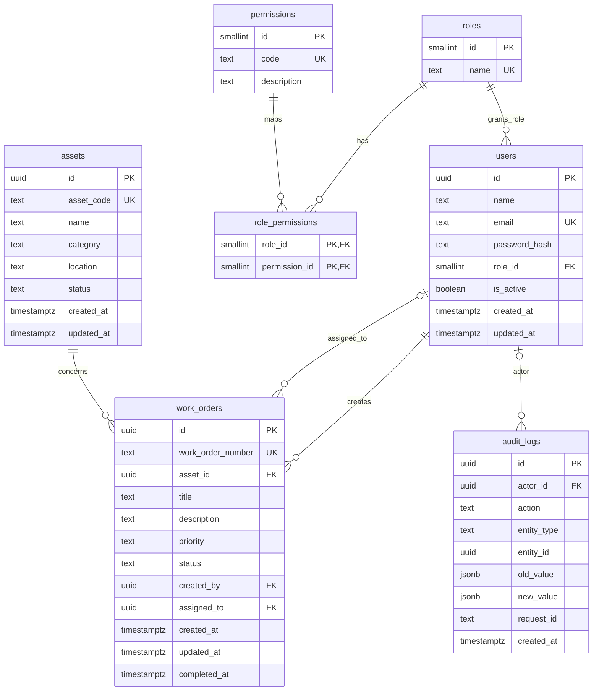

# PostgreSQL schema plan and ERD

Design only: these are not executed migrations. PostgreSQL 16 baseline. All business IDs are UUIDs generated with `gen_random_uuid()`; catalog IDs are smallint with explicit seed values. All timestamps are `timestamptz`, generated by PostgreSQL and serialized as UTC RFC3339. All columns are NOT NULL unless marked nullable below. Text bounds are database checks as well as API validation. Defaults do not replace request validation.

## Complete ERD

`audit_logs.entity_id` is deliberately polymorphic and has no FK: an asset's audit survives hard deletion. `actor_id` may be null only for the explicit bootstrap operation. Each work order has exactly one creator and asset, and zero or one assignee. Users have exactly one role.

## Column specifications

| Table | Columns, types, defaults, bounds |
|---|---|
| roles | `id smallint PK`; `name text UNIQUE` CHECK IN ('ADMIN','MANAGER','TECHNICIAN') |
| permissions | `id smallint PK`; `code text UNIQUE` length 1–80; `description text` length 1–250 |
| role_permissions | `role_id smallint FK`, `permission_id smallint FK`; composite PK(role_id,permission_id) |
| users | `id uuid PK DEFAULT gen_random_uuid()`; `name text` trimmed length 1–100; `email text UNIQUE` trimmed lowercase length 3–254; `password_hash text` length 60; `role_id smallint FK`; `is_active boolean DEFAULT true`; `created_at,updated_at timestamptz DEFAULT now()` |
| assets | `id uuid PK DEFAULT gen_random_uuid()`; `asset_code text UNIQUE` uppercase pattern `^[A-Z0-9][A-Z0-9_-]{0,49}$`; `name text` trimmed 1–150; `category text` trimmed 1–100; `location text` trimmed 1–200; `status text DEFAULT 'ACTIVE'` CHECK in ACTIVE, INACTIVE, MAINTENANCE, RETIRED; `created_at,updated_at timestamptz DEFAULT now()` |
| work_orders | `id uuid PK DEFAULT gen_random_uuid()`; `work_order_number text UNIQUE`; `asset_id uuid FK`; `title text` trimmed 1–200; `description text DEFAULT ''` max 5000; `priority text DEFAULT 'MEDIUM'` CHECK in LOW, MEDIUM, HIGH, CRITICAL; `status text DEFAULT 'OPEN'` CHECK in OPEN, ASSIGNED, IN_PROGRESS, COMPLETED, CANCELLED; `created_by uuid FK`; `assigned_to uuid FK NULL`; `created_at,updated_at timestamptz DEFAULT now()`; `completed_at timestamptz NULL` |
| audit_logs | `id uuid PK DEFAULT gen_random_uuid()`; `actor_id uuid FK NULL`; `action text` from catalogue below; `entity_type text` CHECK in user, asset, work_order; `entity_id uuid`; `old_value,new_value jsonb NULL`; `request_id text` length 1–64; `created_at timestamptz DEFAULT now()` |

Timestamps satisfy `updated_at >= created_at`. SQL UPDATE statements explicitly set `updated_at = now()`; no hidden trigger. Reads never change timestamps.

Additional database checks:

- `status <> 'OPEN' OR assigned_to IS NULL`.
- `status NOT IN ('ASSIGNED','IN_PROGRESS','COMPLETED') OR assigned_to IS NOT NULL`.
- `(status = 'COMPLETED') = (completed_at IS NOT NULL)`; if present, `completed_at >= created_at`.
- Work-order number matches `^WO-[0-9]{4}-[0-9]{6,}$`.
- JSON audit snapshots, when present, must be objects. At least one of old/new is non-null.
- `actor_id IS NOT NULL OR action = 'USER_BOOTSTRAPPED'`; bootstrap action requires null actor.
- Audit action/entity-type match: USER_* → user, ASSET_* → asset, WORK_ORDER_* → work_order.

Foreign keys use ON DELETE RESTRICT, including roles/permissions and audit actor. No cascading removal of history. Deleting users and work orders is unavailable through V1 HTTP; asset DELETE succeeds only if no work order references it, otherwise 409 ASSET_IN_USE.

Email normalization uses trim + ASCII lowercase; accept a conventional ASCII email address (no display-name form); syntactic validation does not establish mailbox ownership. Names/category/location are trimmed; passwords are never trimmed. API rejects invalid asset code rather than silently renaming it.

## Business invariants enforced by services under locks

SQL CHECK constraints do not query other rows. Assignment requires an active TECHNICIAN. Role is immutable after user creation in V1. Deactivation is blocked while the user owns ASSIGNED/IN_PROGRESS orders; terminal assignments remain as history. Account deactivation does not delete a user.

New orders require ACTIVE or MAINTENANCE assets; INACTIVE/RETIRED assets are rejected. Moving an asset to INACTIVE/RETIRED is blocked while any OPEN/ASSIGNED/IN_PROGRESS order references it. Asset statuses otherwise may change freely; asset MAINTENANCE is not automatically coupled to work-order status.

## Concurrency and atomicity

Use READ COMMITTED for mutations. Every work-order mutation locks its work-order row `FOR UPDATE`, then validates lifecycle/ownership using the locked value. Assignment also locks target user `FOR SHARE`, checks active/role, and writes assignment+status+audits in the same transaction. User deactivation locks the user row `FOR UPDATE`, then checks nonterminal assignments. This serializes deactivation against assignment; checks after a lock wait use a fresh statement snapshot.

Order creation locks the asset `FOR SHARE` before checking asset status and inserting. Asset status changes/deletion lock that asset `FOR UPDATE` before checking related orders. No operation acquires an asset lock after acquiring a work-order lock. Multiple rows of the same kind are locked in ascending UUID order.

All user writes take a transaction-scoped advisory lock with a fixed documented user-administration key, then target row locks. User deactivation cannot deactivate the caller and cannot remove the last active ADMIN. Serialize the admin count and write under this lock; bootstrap uses the same lock and refuses if any administrator exists. Work-order assignment never waits for this advisory lock, so it does not create a user-admin lock cycle.

Recheck current actor active status/permission at the start of each write transaction. Concurrent authorization changes take effect for transactions whose authorization check begins after that change commits; an already-authorized transaction may finish. Runtime role-permission edits are not exposed in V1.

Metadata updates apply only supplied columns, preserving unsupplied fields. Concurrent writes to the same field use last-committed-write-wins. State transitions always validate the current locked state: two completion attempts produce one success and one 409. Same-target assignment/status requests are rejected as 409 (not silently replayed). A metadata patch with identical values returns unchanged 200 with no audit or timestamp change.

Rollback all business writes on audit failure. Do not automatically replay non-idempotent POST requests or ambiguous commit failures; request IDs are correlation IDs, not idempotency keys. Known serialization/deadlock failure maps to 409 CONCURRENT_MODIFICATION; unavailable DB maps to 503. An ambiguous commit outcome maps to 503 WRITE_OUTCOME_UNKNOWN; clients must inspect state before retrying.

## Number generation

Create a bigint sequence `work_order_number_seq`, starting at 1, NO CYCLE. Obtain one `nextval` and database UTC year during insert; format `WO-2026-000001`. Minimum six digits, expanding without truncation above 999999 (do not blindly lpad to fixed width). Sequence is global, never reset yearly. Rollbacks consume numbers; gaps are acceptable. Unique constraint remains the final guard. Neither client nor MAX+1 chooses the number.

## Index plan

| Index | Purpose |
|---|---|
| PKs plus UNIQUE(email, asset_code, work_order_number) on their respective tables | Exact lookups and uniqueness; no duplicate indexes |
| `users(role_id)` | Role lookup/FK and technician list filter |
| `users(created_at DESC,id DESC)` | Stable list |
| `assets(created_at DESC,id DESC)` | Stable inventory list |
| `work_orders(created_at DESC,id DESC)` | Global list |
| `work_orders(assigned_to,created_at DESC,id DESC)` | Technician visibility and assignment/deactivation checks |
| `work_orders(asset_id,status)` | Asset guard and filtering |
| `work_orders(status,created_at DESC,id DESC)` | Operational status queue |
| `work_orders(created_by)` | Creator FK checks |
| `audit_logs(entity_type,entity_id,created_at DESC,id DESC)` | Entity history |
| `audit_logs(created_at DESC,id DESC)` | Global audit list |
| `audit_logs(actor_id)` | Actor filter and FK checks |
| `role_permissions(permission_id)` | Reverse FK lookup; PK already covers role_id |

No isolated priority or asset status index initially: measure with EXPLAIN ANALYZE at realistic data sizes before adding low-selectivity indexes. Asset substring ILIKE scans are accepted for V1. Escape `%`, `_`, and backslash for literal search terms; use parameters. Never concatenate filter values into SQL.

## Migrations and seeding

M2 migration sequence: 001 roles; 002 permissions; 003 role_permissions; 004 users; 005 assets; 006 work_orders plus sequence; 007 audit_logs; 008 indexes; 009 fixed role/permission mappings. Down scripts reverse dependencies. Verify clean up/down/up on an isolated DB. Do not run destructive downs in production.

Seed role IDs ADMIN=1, MANAGER=2, TECHNICIAN=3. Permission IDs use the ordered matrix in contracts.md (1–14). Fixed catalog seeds are migrations; sample users/assets are explicit development fixtures only, idempotent by business key, never run on production startup. Hash demo passwords with Go bcrypt in M3, not hand-written placeholder hashes in M2. Bootstrap receives credentials from a one-time secure invocation, creates ADMIN and USER_BOOTSTRAPPED audit atomically, and refuses repeat initialization. Passwords and tokens never enter audit snapshots.

Migration credentials own schema. Runtime credentials have DML on users/assets/work_orders, SELECT on roles/permissions/role_permissions, sequence usage, and only INSERT/SELECT on audit_logs; no audit UPDATE/DELETE and no DDL. DB owners remain able to alter data: this is application audit integrity, not tamper-proof storage.
