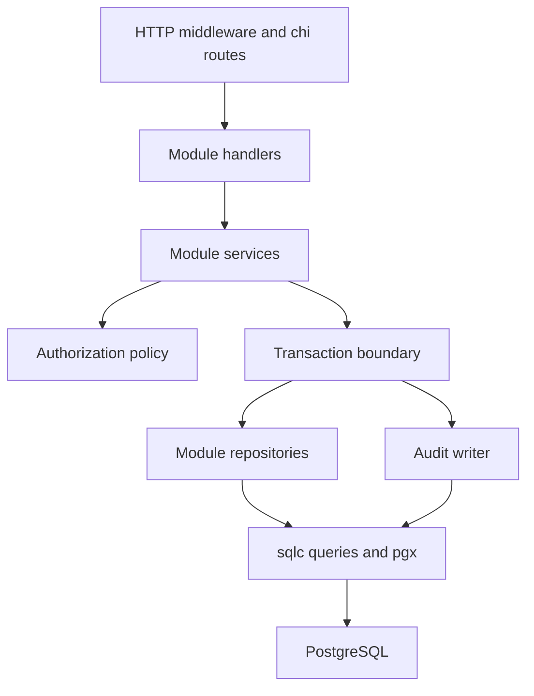

# Milestone 0 — architecture and decisions

Date: 2026-09-10. Repository: https://github.com/Gyebran/GoWork.

## Inspection and scope

GitHub contents API reported an empty repository; cloning confirmed no commits on `main`. No source files, AGENTS.md, dependencies, migrations, CI, or deployment configuration existed. No prior implementation needs migration. The attached brief is preserved verbatim in [project-brief.txt](project-brief.txt).

This delivery contains documentation and a declarative API contract only. Folder names below describe future implementation; no placeholder application scaffold is required at M0. The design is finalized for review, not evidence that V1 exists. Any explicit clarification below overrides the corresponding ambiguous example in the brief once the plan is accepted.

## Architecture

Single-organization modular monolith, one Go binary and one PostgreSQL database. No tenancy abstraction, ORM, cache, queue, or asynchronous audit pipeline. The API is the sole application entry point; clients never connect directly to PostgreSQL.

- Composition root: `cmd/api`; explicitly construct config, logger, pool, repositories, services and handlers. No global mutable clients.
- HTTP: request ID, structured access log, panic recovery, request context timeout, body limits; then authentication, coarse permission check, handler. Validate before service calls. Unknown methods and routes use the same JSON error format.
- Authentication validates JWT and loads the current active user. RBAC loads permissions from current database state, never from a claimed token role. Database failure denies execution with 503, not a misleading 403.
- Handlers translate DTOs and errors; no SQL or business transitions in handlers. Services own policies, resource checks and transactions. Repositories adapt sqlc rows into module models and named domain errors.
- Generated code stays in `internal/platform/database/sqlc`; imports flow inward to platform/shared types. Module services do not call one another's HTTP handlers. Small consumer-owned interfaces exist for service tests, not for every struct.
- Transaction runner creates transaction-bound repositories and audit writer from the same `Queries.WithTx(tx)`. Services must not accidentally use pool-backed queries inside a transaction. Audit has no independent commit path.
- `context.Context` passes through all request calls; rollback cleanup may use a short independent timeout when the request was cancelled. Commit errors propagate; return success only after commit.
- Persistent write plus required audit is atomic, including user/asset writes. Login failures belong in operational logs, not mutation audit rows.

## Technology decisions

| Area | Decision and rationale |
|---|---|
| Go | Baseline Go 1.27.1, shown by official downloads at planning time; pin toolchain at M1 and use the same version in CI/build images. Recheck security patches before implementation. |
| HTTP | chi v5 on net/http: familiar standard interfaces, small routing layer. |
| Storage | PostgreSQL 16 baseline: relational constraints and transactions fit the domain. Compatible hosted newer versions require integration validation. |
| Query access | pgx v5 + sqlc with explicit parameterized SQL; no generic repository or ORM. |
| Migrations | golang-migrate v4, ordered up/down SQL; separate migration credentials. |
| Auth | golang-jwt/jwt v5; HS256 single-service access tokens; bcrypt from x/crypto; DB-authoritative permission checks. |
| Validation | Explicit DTO validation using standard library plus small helpers; no validation dependency until justified. |
| API | OpenAPI 3.0.3, hand-maintained contract; Swagger UI hosting belongs to M11. |
| Deployment | Render Docker web service plus same-region managed PostgreSQL; verify plan availability and database version at M12. No infrastructure created in M0. |

Except the Go baseline and major-version choices, resolve and pin exact compatible dependency/tool versions at their first implementation milestone. Commit go.mod/go.sum and explicit tool/image versions; never depend on floating `latest` in reproducible builds.

## Final planned folder structure

| Path | Responsibility / introduction |
|---|---|
| `cmd/api/main.go` | Composition, server lifecycle (M1) |
| `cmd/bootstrap/main.go` | Explicit initial administrator command (M3); no HTTP registration |
| `internal/auth/{handler,service,middleware}.go` | Login, token verification, current-user lookup (M3) |
| `internal/user/{model,handler,service,repository}.go` | Admin provisioning and user reads/updates (M4) |
| `internal/asset/{model,handler,service,repository}.go` | Asset use cases (M5) |
| `internal/workorder/{model,handler,service,repository}.go` | Work-order operations and lifecycle (M6) |
| `internal/audit/{model,writer,repository,handler}.go` | Writer starts M3; read handler M7 |
| `internal/rbac/{policy,service,middleware}.go` | DB permissions and ownership policy (M4) |
| `internal/platform/config/` | Validated environment settings (M1 onward) |
| `internal/platform/database/` | Pool, transaction runner, DB error translation (M2 onward) |
| `internal/platform/database/sqlc/` | Generated pgx query code, never hand-edited (M2) |
| `internal/platform/httpx/` | Response envelopes, errors, middleware, pagination (M1 onward) |
| `db/migrations/` | Versioned schema and fixed role/permission seed SQL (M2) |
| `db/queries/` | SQL by users, assets, work_orders, rbac, audit (M2 onward) |
| `db/seeds/` | Explicit local-only demo fixture instructions (M2/3) |
| `docs/` | Current plan, OpenAPI, verification and original brief |
| `tests/integration/` | Isolated real-PostgreSQL HTTP and transaction checks |
| Module `*_test.go` files | Behavior tests next to implementation |
| `go.mod`, `go.sum`, `.env.example`, `.gitignore`, `Makefile` | Introduced progressively starting M1 |
| `sqlc.yaml` | pgx/v5 target and generated output path (M2) |
| `Dockerfile`, `docker-compose.yml`, `.dockerignore` | Full container packaging (M9); DB-only Compose may start M2 |
| `.github/workflows/ci.yml` | Full CI gate (M10) |

## Blueprint issues and resolutions

| Brief reference / weakness | Final M0 decision | Tradeoff |
|---|---|---|
| §14 user API absent from §55 milestones | M4 includes user list/detail/create/update and RBAC tests | M4 is larger but has no hidden leftover feature |
| §14 DELETE users vs audit/creator FKs | Omit DELETE; add reversible `is_active` on users through PATCH | Account deactivation is access control, not generic soft-delete infrastructure |
| §16 DELETE work orders vs operational history | Omit DELETE; use CANCELLED via status endpoint | Preserve records and audit lineage |
| §13 public registration unspecified | No register route; admin provisioning plus explicit bootstrap | No public signup or accidental privilege selection |
| §3 update permission mixes metadata and status | Add `work_order:status:update` and `work_order:cancel`; technicians get neither metadata nor assignment rights | Extra permission rows clarify least privilege |
| §2 technician asset access unclear | Technicians read assets only when linked to their assigned orders, including terminal ones | No global equipment inventory exposure |
| §18 reassignment and cancellation optional | Assignment only OPEN/ASSIGNED; enable cancellation from all nonterminal states; no reopen | Simple, auditable lifecycle |
| §20/§55 audit postponed to M7 | Transaction runner M2; writer by first M3 mutation, used in M4–M6; M7 adds read API and full audit verification | Avoid rewriting unsafe earlier write paths |
| §21 concurrency unspecified | Lock current row and relevant referenced users/assets; validate under lock | Metadata remains last-committed-write-wins for overlapping fields; no optimistic version API in V1 |
| §7 human-readable number generation unspecified | PostgreSQL global sequence, `WO-<UTC year>-<sequence>`; gaps allowed, no annual reset | Unique and concurrent-safe, not gapless accounting numbers |
| §7 role changes and disabling technician undefined | User role immutable V1; deactivation blocked with assigned nonterminal orders | Reassign/cancel before disabling; dynamic RBAC editing postponed |
| §24 JWT expiry/rotation undefined | 15-minute HS256 tokens; no refresh/logout route; active user checked each request | Re-login and global key rotation instead of token blacklist |
| §23 blanket indexes | Unique constraints supply their indexes; add workload-backed composite indexes only | Small-table ILIKE scans accepted until measured |
| §33 list/count consistency undefined | Same read-only repeatable-read transaction for list+count; stable tie-breaking sort | Consistent response, no cross-request pagination snapshot |
| §44 deployment could be mistaken for free guarantee | Select architecture/provider, defer cost/plan/account provisioning to M12 | No unverified pricing or uptime claims |
| §35 tests could be postponed | Tests accompany each milestone; M8 consolidates coverage and races | 40 scenario target, not artificial coverage targets |

No frontend, Redis, microservices, AI, payments, WebSockets, uploads, or V2 features are introduced. Role and permission catalogue changes are reviewed migration changes, not V1 REST endpoints.

## References checked during planning

These support technical mechanics; policy choices above are project decisions.

- [Go downloads](https://go.dev/dl/): baseline toolchain.
- [sqlc transactions](https://docs.sqlc.dev/en/latest/howto/transactions.html): transaction-bound queries.
- [PostgreSQL 16 locking](https://www.postgresql.org/docs/16/explicit-locking.html): row-lock behavior.
- [Go bcrypt](https://pkg.go.dev/golang.org/x/crypto/bcrypt): password byte limit.
- [OpenAPI 3.0.3](https://spec.openapis.org/oas/v3.0.3.html): contract format.
- [Render web services](https://render.com/docs/web-services): Docker runtime and port binding.
